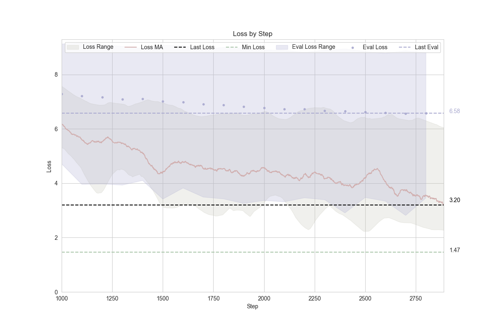

# kl3m-embedding-research

### Versions
**There have been a number of breaking changes in the `transformers`, `tokenizers`, and `cuda` libraries over the last 12 months.**

In order to replicate the training process or run `mteb` benchmarks, you may need to:
 * Use the `transformers` and `tokenizers` versions specified in the `pyproject.toml` file.
 * Remove cached files under `~/.cache/huggingface/hub/`
 * Check that you are on H100s with CUDA version between 535-560.

## Description

This ALEA project contains the research pipeline for the KL3M embedding models.

(The KL3M tokenizers have been moved to the [kl3m-tokenizers](https://github.com/alea-institute/kl3m-tokenizers) repository.)

## Model Cards

TODO

## Training a Model

You can replicate or train your own model like this:

1. Pick a model configuration under the `models/` directory.
2. Review the `config.json` and `training.json` files for details related to the model architecture and training parameters.
3. Run the training script for the model you want to train using the commands below.
4. Monitor progress with the `describe.py` script using the commands below.

Model training can be resumed as long as the `log.jsonl` file is present in the model configuration or checkpoint path.

### DeBERTa-based Models


#### torch only (single GPU)
```bash
$ PYTHONPATH=. poetry run python3 kl3m_embeddings/embeddings/deberta/train_deberta_single.py models/kl3m-embedding-005/
```

#### torch + deepspeed (multi-node, multi-GPU)
```bash
$ DS_SKIP_CUDA_CHECK=1 PYTHONPATH=. poetry run deepspeed kl3m_embeddings/embeddings/deberta/train_deberta_deepspeed.py models/kl3m-embedding-005-deepspeed-2/
```


### Monitoring Progress

```bash
$ PYTHONPATH=. poetry run python3 kl3m_embeddings/embeddings/describe.py models/kl3m-embedding-005/log.jsonl
```

## Example Outputs

**Progress Example**
```
Training:   4%|█▊        | 7247/200000 [09:38<4:41:05, 11.43it/s, loss=1.37, loss_100=2.623, loss_1000=4.955, last_eval=5.69, grad_norm=1.12, lr=2.0e-04, step_time=0.08, token_rate=86553.61]
```


**Sample Log Line** (`log.jsonl`)
```json
{"step": 2600, "epoch": 1, "lr": 0.0002, "sample_time": 0.0018472671508789062, "reduced_dim": 64, "task": "mlm", "num_samples": 128, "num_identifiers": 2, "num_tokens": 16384, "samples_by_dataset": {"ukleg": 64, "govinfo": 64}, "tokens_by_dataset": {"ukleg": 8192, "govinfo": 8192}, "loss": 8.297395706176758, "forward_time": 0.0015826225280761719, "backward_time": 0.0047855377197265625, "clip_threshold": 3.105683786869049, "step_time": 1.8407979011535645, "total_time": 298.2537636756897, "token_rate": 119195.14296106658, "time": "2024-10-22T09:12:42.395676"}
```

**Sample Eval Line** (`eval.jsonl`)
```json
{"step": 2600, "mean": 6.590894358307123, "median": 6.974860191345215, "std": 1.9348315678504489, "min": 0.1022321879863739, "p5": 3.3413278245925904, "p95": 8.781183547973633, "max": 13.027746200561523, "num_samples": 1000, "svd_mean_ratio_1": 2.2945302575826645, "svd_median_ratio_1": 2.4049798250198364}
```





## License

This ALEA project is released under the MIT License. See the [LICENSE](LICENSE) file for details.

## Support

If you encounter any issues or have questions about using this ALEA project, please [open an issue](https://github.com/alea-institute/kl3m-embedding-research/issues) on GitHub.

## Learn More

To learn more about ALEA and its software and research projects like KL3M, visit the [ALEA website](https://aleainstitute.ai/).
